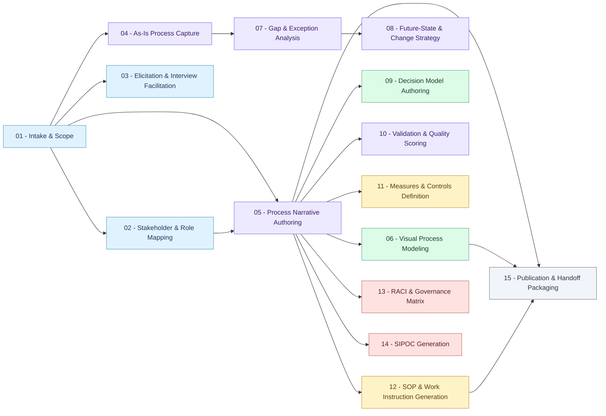

# BP-SKILL v0.3 — Skill Dependency Flow

Derived from `depends_on` in each skill's `SKILL.md` frontmatter via
`scripts/extract-skill-deps.mjs`. Re-run that script after editing any SKILL.md.

Paste the Mermaid block below into a Notion code block (language: Mermaid),
or open it at https://mermaid.live.

## Layers

| Color | Layer | Skills |
|---|---|---|
| Blue | Discovery | Intake & Scope, Stakeholder Map, Elicitation |
| Purple | Narrative | As-Is Capture, Narrative Authoring, Gap Analysis, Future State, Validation |
| Green | Visual Modeling | Visual Process Modeling, Decision Model Authoring |
| Amber | Operational | Measures & Controls, SOP & Work Instructions |
| Red | Governance | RACI & Governance Matrix, SIPOC |
| Gray | Publication | Publication & Handoff Packaging |
