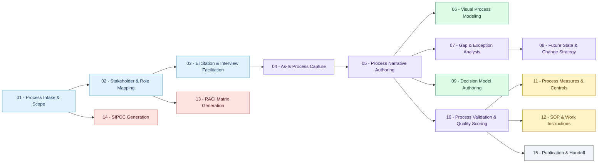

# BP-SKILL v0.3 — Skill Dependency Flow

Generated from `depends_on` metadata in each skill's `SKILL.md`.

Paste the code block below into a Notion code block (set language to **Mermaid**).
Or open [mermaid.live](https://mermaid.live), paste the code, and screenshot the result.

## Layers

| Color | Layer | Skills |
|---|---|---|
| Blue | Discovery | Process Intake & Scope, Stakeholder & Role Mapping, Elicitation |
| Purple | Narrative | As-Is Capture, Narrative Authoring, Gap Analysis, Future State, Validation |
| Green | Visual Modeling | Visual Process Modeling, Decision Model Authoring |
| Amber | Operational | SOP & Work Instructions, Process Measures & Controls |
| Red | Governance | RACI Matrix, SIPOC |
| Gray | Publication | Publication & Handoff |
